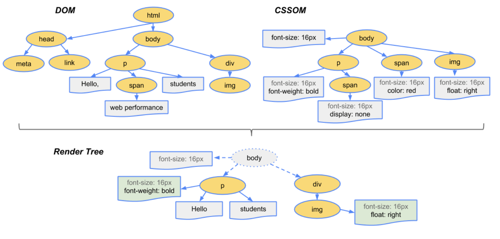

# 질문 : Virtual DOM이란?

 

## DOM 이란?

우리가 텍스트 파일로 만든 HTML, CSS 파일이 브라우저에 표현이 되려면 어떤 과정이 있어야 할까? 이러한 파일들을 브라우저에 렌더링 하려면 `브라우저가 이해할 수 있는 구조`로 메모리에 올려야 한다.

 

## 브라우저가 이해할 수 있는 구조?

브라우저의 렌더링 엔진은 모든 요소(Element)와 속성(Attribute)등을 각각의 객체로 만들고 이것을 트리 구조로 구성한다. 우리는 이를 `DOM`이라고 부른다. 

 

## 브라우저가 DOM을 생성해서 화면에 보여지기까지 동작 과정?

> 브라우저 로딩 과정: 파싱 > 스타일 > 레이아웃(리플로우) > 페인트 > 합성 & 렌더

(1) DOM Tree 생성 
브라우저가 전달 받은 HTML,CSS를 `DOM으로 변환`  

(2) Render Tree 생성 
css 등 스타일 요소 attach DOM Tree와 같게 `실제 화면에 표현되는 Render Tree` 생성 

(3) Layout 
각 노드들이 어디에 나타야할지 스크린 좌표 계산(브라우저 화면의 어느 위치에 어느 크기로 출력될지 계산) 

(4) Paint 
랜더링 된 요소에 색을 입히는 과정(요소를 가지고 실제 화면을 그리게 됨)

 

## 위 브라우저 로딩과정의 문제?

Element를 추가, 수정, 삭제 하면 DOM이 수정되면서 위 과정이 다시 이루어진다. 이는 리소스가 변경 될 때마다 전체 페이지를 갱신 시킨다고 생각하면 된다. 그래서 생겨난 것이 `Virtual DOM` 이다.

 

## Virtual DOM 이란?

만약 뷰에 변화가 있다면 실제 DOM에 적용되기 전에 가상의 DOM에 먼저 적용 시키고, 최종적인 결과를 DOM으로 전달해준다. 이러면서 브라우저 내의 발생하는 연산의 양을 줄이면서 성능이 개선되는 것이다.

(1) 데이터가 업데이트 되면, 전체 UI를 Virtual DOM에 리렌더링 한다.

(2) 이전 Virtual DOM에 있던 내용과 현재의 내용을 비교한다.

(3) 최종 결과물에서 바뀐 부분만 실제 DOM에 적용을 시킨다.

 

## Virtual DOM 이 해결 하려고 하는것?

- DOM fragment를 관리하는 과정을 수동으로 하나하나 작업 할 필요 없이, 자동화하고 추상화 해준다.

- 기존에 DOM이 어떤 값이 바뀌고 어떤 값이 바뀌지 않았는지 계속 파악하고 있어야 하는데 이것도 Virtual DOM이 자동으로 해준다.(DOM관리를 Virtual DOM이 해준다.)

 

## 참고자료

https://velopert.com/3236  
https://ryublock.tistory.com/41
