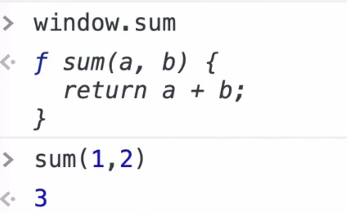
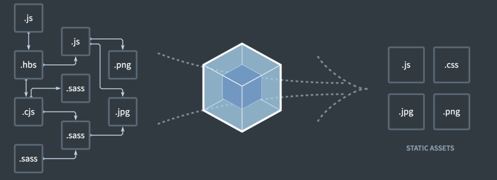
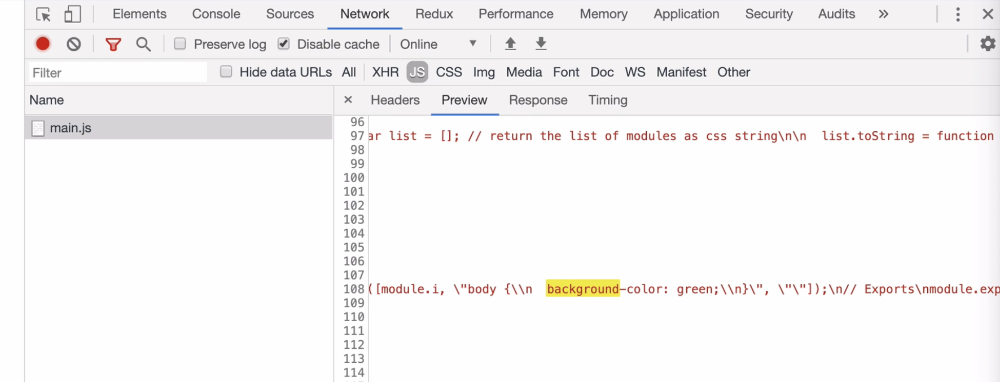
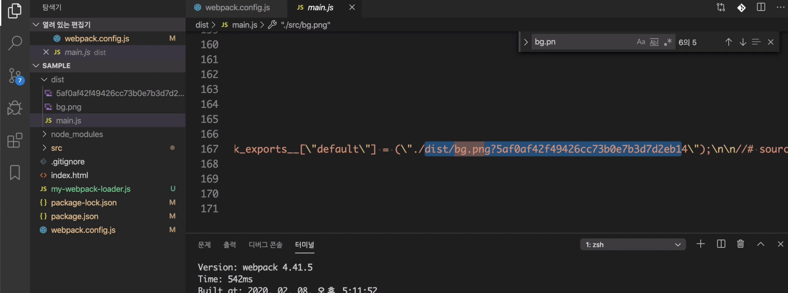
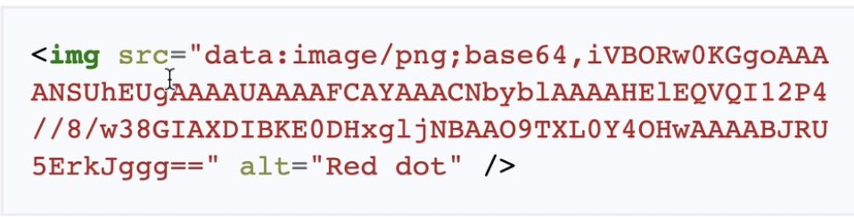

# 웹팩이란? 모듈 번들러란?

## 웹팩의 배경(모듈이 필요한 이유)

문법 수준에서 모듈을 지원한 것은 es2015부터이다.

```javascript
//math.js
function sum(a, b) {
  return a + b;
}

//sum.js
console.log(sum(1, 2));
```



전역스코프가 오염되게 되버리고, 런타임 에러가 발생한다. (윈도우객체로 sum호출가능)

위 문제를 해결하기 위해 `IIFE방식(즉시실행함수표현)` 을 사용한다.

```javascript
//math.js
var math = math || {};
(function () {
  function sum(a, b) {
    return a + b;
  }
  math.sum = sum;
})();

//sum.js
console.log(math.sum(1, 2));
```

이러한 방식으로 다양한 모듈 스펙이 존재하는데 대표적으로 AMD, CommonJs가 존재한다.

```javascript
CommonJs;

//math.js
export function sum(a, b) {
  return a + b;
}

//sum.js
const sum = require("./math.js");
sum(1, 2);
```

이렇게 나오다가 ... es2015에서 표준 모듈 시스템을 내놓았다.

```javascript
//math.js
export function sum(a, b) {
  return a + b;
}

//sum.js
import * as math from "./math.js";
//import { sum } from './math.js';

math.sum(1, 2);
```

이렇게 만든 모듈시스템이 모든 브라우저에서 지원하는건 아니다..(예를들어 ie..)

```javascript
//첫번째 방식대로 사용했던걸 두번째 방식으로 사용.. 그러나 크롬에서만 적용
<script src="sum.js"></script>

<script type="module" src="sum.js"></script>
```

그러나 브라우져에 무관하게 모듈을 사용하고 싶은데.. 이제야 웹팩이 나올 차례이다.

</br>

## 웹팩(Webpack)



위 사진과 같이 모듈간의 의존 관계가 생기게 된다. (import 키워드로 불렀을 시)

웹팩은 이렇게 모듈로 연결된 여러개의 자바스크립트 파일을 하나로 합쳐주는 역할을 한다. 이러한 것을 `번들(bundle)` 이라고 하고, 웹팩은 번들러 역할을 한다.

### 1. 엔트리와 아웃풋

모듈이 시작되는 부분을 `엔트리`라고 한다. 그 결과를 저장하는 곳을 `아웃풋`라고 한다.

```javascript
//위 명령어 사용 후, 아래와 같이 스크립트를 부를 수 있다.
node_modules/.bin/webpack --mode development --entry ./sum.js --output dist/main.js

<script src="dist.js"></script>
```

보통 위와 같이 매번 명령어를 치면서 설정할 수 없으므로, `webpack.config.js` 파일을 만들어서 설정해 둔다.

```javascript
//webpack.config.js

const path = require("path");

module.exports = {
  mode: "development",
  entry: {
    main: "./sum.js",
  },
  output: {
    path: path.resolve("./dist"),
    filename: "[name].js", //entry의 main 값이 들어간다.
  },
};
```

<br>

### 2. 로더

자바스크립트 뿐만 아니라 css, image, font 같은 것들도 모듈로 처리한다. 이것이 가능한 이유는 웹팩이 `로더(loader)` 덕분이다.

```javascript
//my-webpack.loader.js
module.exports = function myWebpackLoader(content) {
  console.log("myWebpackLoader가 동작함");
  return content;
};
```

```javascript
//webpack.config.js
const path = require("path");

module.exports = {
  mode: "development",
  entry: {
    main: "./sum.js",
  },
  output: {
    path: path.resolve("./dist"),
    filename: "[name].js", //entry의 main 값이 들어간다.
  },
  module: {
    rules: [
      {
        test: /\.js$/, //loader가 처리해야 할 정규표현식(js확장자를 가진 모듈을 로더로 돌리겠다)
        use: [path.resolve("./my-webpack.loader.js")], //모든 자바스크립트 코드에서 loader가 실행되게
      },
    ],
  },
};
```

<br>

### 2.1 자주 사용되는 로더

> css-loader, style-loader, file-loader, url-loader

- **css-loader**<br>
  웹팩은 모든것을 모듈로 바라보기 때문에 자바스크립트 뿐만 아니라 `스타일시트를 모듈`로 불러올 수 있다. 아래 코드 실행 시 빌드된 결과가 문자열 형태로 번들된 결과물에 포함된다.(css)

```javascript
//app.js
import "./test.css";

//test.css
body {
  background-color: green;
}
```

```javascript
//webpack.config.js
const path = require("path");

module.exports = {
  ...
  module: {
    rules: [
      {
        test: /\.css$/,
        use:[
          'css-loader'  //css-loader가 css 를 처리
        ]
      },
    ],
  },
};
```



<br><br>

- **style-loader**<br>
  근데 위와 같은 설정 만 해준다면 화면에 나오지 않는다. 이유는 cssdom 으로 변환 되면서 나와야 하는데 이런 경우는 html 에 직접 불러오거나, 인라인 스타일 형태로 작성해야지만 변환 돼서 나오게 된다. 이때 나오는 것이 `style-loader` 이다. style-loader는 html에 주입시켜서 스타일을 적용시켜준다. css-loader 와 style-loader를 같이 사용해야 한다.

```javascript
//webpack.config.js
module.exports = {
  ...
  module: {
    rules: [
      {
        test: /\.css$/,
        use:[
          'style-loader',
          'css-loader'  //css-loader가 css 를 처리
        ]
      },
    ],
  },
};
```

<br><br>

- **file-loader** <br>
  이미지를 처리할 수 있는 `file-loader`

```javascript
//webpack.config.js
module.exports = {
  ...
  module: {
    rules: [
      ...
      {
        test: /\.png$/.
        loader: 'file-loader', //로더이름 설정
        options:{
          publicPath: './dist/', //file-loader가 호출 할 때 default로 붙는 경로
          name: '[name].[ext]?[hast]' //hash를 사용하여 캐쉬 문제 해결가능
        }
      }
    ],
  },
};
```

  

<br><br>

- **url-loader** <br>
  사용하는 이미지 갯수가 많아지면 네트웤 부담이 될 수 있다. 사이트 성능에도 영향이 있어서 만약에 한페이지 안에서 작은이미지 여러개를 사용한다면 `데이터 URI 스키마`를 이용하는 것이 낫다.
  <br>
  위 사진처럼 주소를 쓰기 대신 값을 바로 넣어서 사용한다.(네트웤 통신이 없다!)

```javascript
//webpack.config.js
module.exports = {
  ...
  module: {
    rules: [
      ...
      {
        test: /\.(png|jpb|gif|svg)$/.
        loader: 'url-loader', //로더이름 설정
        options:{
          publicPath: './dist/',
          name: '[name].[ext]?[hast]'
          limit: 2000, //파일용랑설정, 2kb(2kb 미만은 url-loader, 이상은 file-loader 가 처리)
        }
      }
      ...
    ],
  },
};
```

<br>

### 3. 플러그인(plugin)

로더가 파일 단위로 처리하는 반면 플러그인은 번들된 결과물을 처리한다.(후처리) `번들된 자바스크립트를 난독화` 하거나 `특정 텍스트를 추출`하는 용도로 사용한다.

```javascript
//my-webpack-plugin.js
class MyWebpackPlugin {
  apply(compiler) {
    // compiler.plugin() 함수로 후처리(번들 결과에 접근)
    compiler.plugin("emit", (compilation, callback) => {
      const source = compilation.assets["main.js"].source();
      console.log(source);
      callback();
    });

    // 플러그인 작업이 완료되는 시점
    compiler.hooks.done.tap("My Plugin", (state) => {
      console.log("MyPlugin: done");
    });
  }
}
module.exports = MyWebpackPlugin;
```

```javascript
//webpack.config.js
const MyWebpackPlugin = require('./my-webpack-plugin');

module.exports = {
  ...
  module: {
    output:{
      ...
    }
    rules: [
      ...
    ],
    plugins:[
      new MyWebpackPlugin(),
    ]
  },
};
```

### 3-1. 자주사용하는 플러그인

> 추후 정리

- BannerPlugin
- DefinePlugin
- HtmlWebpackPlugin
- CleanWebpackPlugin
- MiniCssExtractPlugin

<br>

### 4. 정리

es6 이전에는 모듈을 만들기 위해 즉시 실행함수와 네임스페이스 패턴을 사용했다. 이후에 es6에서 모듈 시스템을 쉽게 사용할 수 있게 제공했다. 엔트리 포인트를 시작으로 연결되어 있는 모든 모듈을 하나로 합쳐서 결과물을 만드는 것이 웹팩이 역할이다.

<br>

### 참고자료

https://joshua1988.github.io/webpack-guide/webpack/what-is-webpack.html#%EB%AA%A8%EB%93%88%EC%9D%B4%EB%9E%80
https://jeonghwan-kim.github.io/series/2019/12/10/frontend-dev-env-webpack-basic.html#1-%EB%B0%B0%EA%B2%BD
