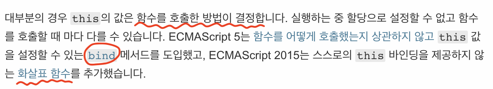

## this

> Javascript document 참조



- this : 메소드를 호출할 객체가 저장되어 있는 속성
- 가장 중요한 keyword : `함수를 호출하는 방법`, `this === 호출한 놈, 누가 호출했냐?`

<br>

#### [this 호출 예시 1]

- 아래 코드의 결과를 생각해보자

```javascript
var someone = {
  name: "kyungmin",
  whoAmI: function () {
    console.log(this);
  },
};
someone.whoAmI();
```

<details>
    <summary>결과</summary>
    <div markdown="1">
       someone {name:'kyungmin', whoAmI: f} //someone 객체
    </div>
</details>
<br/><br/><br/>

- 이번엔 다른 방법으로 호출해 보겠다.

```javascript
var someone = {
  name: "kyungmin",
  whoAmI: function () {
    console.log(this);
  },
};
// someone.whoAmI()  -> 여기까지 위 코드와 동일

var myWhoAmI = someone.whoAmI;
myWhoAmI();
```

<details>
    <summary>결과</summary>
    <div markdown="1">
        Window {postMessage: f, blur: f ....} //윈도우 객체
    </div>
</details>
<br/><br/><br/>

- 결과가 다른 이유? **(직접 호출되는 코드를 확인해보자)**

  - someone.whoAmI() : `whoAmI`를 직접적으로 호출한 건 `someone`
  - myWhoAmI() : `myWhoAmI` 는 글로벌에 선언되어 있고, 글로벌은 `윈도우 객체(브라우저)`

<br/><br/>

- 왜 전역객체(글로벌객체) 가 window?, 그리고 함수의 this가 기본적으로 왜 window?

  - 자바스크립트 실행 컨텍스트와 연관해서 생각해 봐야 함.(어떻게 전역객체 this가 window인지..)  
    <a target="_blank" href="https://velog.io/@imacoolgirlyo/JS-%EC%9E%90%EB%B0%94%EC%8A%A4%ED%81%AC%EB%A6%BD%ED%8A%B8%EC%9D%98-Hoisting-The-Execution-Context-%ED%98%B8%EC%9D%B4%EC%8A%A4%ED%8C%85-%EC%8B%A4%ED%96%89-%EC%BB%A8%ED%85%8D%EC%8A%A4%ED%8A%B8-6bjsmmlmgy">"Execution Context and This"</a> 참고

  - 콘솔에 window를 치고 .(점)을 치는 순간 많은 추천목록이 나온다. 윈도우 객체의 속성과 메소드이다. 보통 전역으로 선언할 때 `window.parseInt()` 해야 하는데 `parseInt()` 만
    해도 되는 이유는 전역객체는 모든 객체를 다 포함하고 있어서 생략 가능하다.

  - 우리가 만들었던 변수들(함수 안에서 선언한 변수 제외)도 모두 window 객체 안에 등록된다.(이유는 위 문서 참고)

<br/><br/>

#### [this 호출 예시 2]

- 아래의 버튼 이벤트가 작성되어 있고 `버튼을 눌렀을 때` 결과를 생각해보자.

```javascript
var someone = {
  name: "kyungmin",
  whoAmI: function () {
    console.log(this);
  },
};
//버튼 이벤트
var btn = document.getElementById("btn");
btn.addEventListener("click", someone.whoAmI);
```

<details>
    <summary>결과</summary>
    <div markdown="1">
    클릭한 버튼
</div>
</details>

<br/><br/>

- 결과가 위와같이 나온 이유?  
  - someone이 whoAmI를 호출한게 아니다. whoAmI함수를 꺼내서 button에 넘겨준 것. 즉 호출은 `button`

<br/><br/>

#### [this 호출 예시 3]

- 위 경우를 참고로 해서 아래 코드의 결과를 생각해 보자.

```javascript
$("div").on("click", function () {
  console.log(this); // 1
});
```

```javascript
$("div").on("click", function () {
  console.log(this); // 2
  function inner() {
    console.log("inner", this); // 3
  }
  inner();
});
```

<details>
    <summary>결과</summary>
    <div markdown="1">
    1. 클릭한 div  <br/>
    2. 클릭한 div  <br/>
    3. window  -> 함수의 this는 기본적으로 window
</div>
</details>
<br/><br/>

- inner을 호출 했을 시 똑같은 결과값을 가지고 싶으면?

  - `this`를 변수에 저장

    ```javascript
    $("div").on("click", function () {
      console.log(this); // <div>
      var that = this;
      function inner() {
        console.log("inner", that); // inner <div>
      }
      inner();
    });
    ```

  - es6 `화살표 함수`

    > this로 window대신 상위 함수의 this를 가져온다.(여기서는 div)

    ```javascript
    $("div").on("click", function () {
      console.log(this); // <div>
      const inner = () => {
        console.log("inner", this); // inner <div>
      };
      inner();
    });
    ```

#### [bind]

> `bind`는 `함수의 메서드`이다.(함수의 프로퍼티를 메서드라고 부름), bind와 비슷하게 call, apply가 있다.
>
> > call, apply에 대해 자세히 알고 싶다면 다음 문서를 참고하자. <a target="_blank" href="https://medium.com/@jhawleypeters/javascript-call-vs-apply-vs-bind-61447bc5e989">"call vs apply vs bind 정리 문서"</a>

<br/><br/>

**1. 바인딩이란?**

javascript의 함수는 각자 자신만의 this라는 것을 정의한다. 함수의 this는 기본적으로 window 지만 꼭 window 만이라고 말할 수 없다.
this는 `객체내부`, `객체 메서드 호출 시`, `생성자 new호출 시`, `명시적 bind`에 따라 바뀐다.

전 내용처럼 this를 그때 그떄 알맞은 객체로 바꿔서 다르게 호출하려는 것이 `this`의 `binding` 이다. 명시적으로 this를 window가 아닌
다른 객체로 바꿔주는 함수의 메서드가 `call`, `apply`, `bind` 이다.

<br/><br/>

**2. bind 예시**

- bind를 사용하면 this를 설정해 줄 수 있다. 아래코드 결과를 예상해보자.

```javascript
var someone = {
  name: "kyungmin",
  whoAmI: function () {
    console.log(this);
  },
};
someone.whoAmI(); // 1

var myWhoAmI = someone.whoAmI;
myWhoAmI(); // 2

var bindedWhoAmI = myWhoAmI.bind(someone);
bindedWhoAmI(); // 3

var btn = document.getElementById("btn");
btn.addEventListener("click", bindedWhoAmI); // 4
```

<details>
    <summary>결과</summary>
    <div markdown="1">
        1. someone  <br/>
        2. window   <br/>
        3. someone  <br/>
        4. someone (버튼 클릭 시)
    </div>
</details>
<br/><br/><br/>

**3. call과 apply 예시**

```javascript
const obj = { name: "kyungmin" };
const say = function (city) {
  console.log(`My name is ${this.name}, I live in ${city}`);
};
say("seoul"); // My name is , I live in seoul
say.call(obj, "seoul"); // My name is kyungmin, I live in seoul
say.apply(obj, ["seoul"]); // My name is kyungmin, I live in seoul
```

첫 번째 실행인 `say("soeul")`의 경우는 say가 실행 될 때 this에 아무런 setting이 되어있지 않으므로 this는 window객체이다.

두 번째 실행인 `say.call(obj, "seoul")`의 경우와 세 번째 실행인 `say.apply(obj, "seoul")`은 this를 obj로 변경시켰으므로 원하는 값이 나온다.

call과 apply의 유일한 차이점은, 첫 번째 인자(this를 대체할 값)를 제외하고, 실제 say에 필요한 parameter를 입력하는 방식이다. call과는 다르게 apply함수는 두 번째 인자부터 모두 배열에 넣어야 한다.

<br/><br/>

### (4) 정리

this는 기본적으로 window이지만, 객체 메서드, bind call apply, new일 때 this가 바뀐다. 그리고 이벤트리스너나 기타 라이브러리처럼 this를 내부적으로 바꿀 수도 있어서 항상 this를 확인해 봐야 한다. 특히 선언한 function의 this는 항상 window라는 것을 기억하자.
