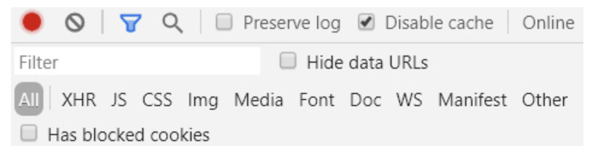

# 프론트엔드 성능 최적화

## 브라우저 동작원리

> 브라우저 로딩 과정: 파싱 > 스타일 > 레이아웃(리플로우) > 페인트 > 합성 & 렌더

프론트엔드의 성능 최적화를 확인하기에 앞서서 브라우저가 어떻게 화면을 사용자에게 보여주는지를 알아야 한다.

[브라우저의 렌더링 과정 링크](https://github.com/FrontStudy/doongji-front-study/tree/main/YunSeong/%EB%B8%8C%EB%9D%BC%EC%9A%B0%EC%A0%80%EC%9D%98%20%EB%A0%8C%EB%8D%94%EB%A7%81%20%EA%B3%BC%EC%A0%95)

<br><br>

## 프론트엔드 성능 최적화

> 프론트 엔드 성능 최적화에는 `웹 페이지 로드 최적화`, `웹 페이지 렌더링 최적화`가 있다.

### 1. 웹 페이지 로드 최적화

(1) 브라우저상에서 최적화 <br>
`DOMContentLoaded` : html, css 파싱 끝난 시점 <br>
`Loaded` : html 상에 모든 리소스가 load된 시점 <br><br>

**크롬 개발자도구**<br><br>


html, css파싱을 진행하다가 script 태그와 만나게되면 javscript파싱을 진행하게 되고 그 이후로 동기적으로 파싱이 된다. 그래서 html, css를 파싱하면서 자바스크립트로 인해 `block resource`가 발생하는걸 방지해야 한다.

```javascript
//block resource 방지
<!DOCTYPE html>
<html>
  <head>
    <meta charset="utf-8">
    <title>My test page</title>
    <!-- css는 여기에 위치 -->
  </head>
  <body>
    <div>
    </div>

    <!-- js는 body 하단에 위치 -->
    <script>
    //...
    </script>
  </body>
</html>
```

<br>

(2) 리소스 용량 줄이기 <br>
리소스 용량을 줄임으로써 리소스 다운로드 시간을 최적화 할 수 있다.

<br>

**크롬 개발자 도구의 network탭 -> 필터에서 리소스 유형**<br><br>
<br>
XHR은 xml http request로 브라우저단에서 서버단으로 HTTP 비동기 통신 할 때 request 가 어떻게 쉉되어 서버로 전달되는지와 서버로부터 요청에 따른 Response 결과를 확인하는 용도이므로 제외한다.

- 불필요한 코드는 제거한다.
- 압축 및 난독화로 용량을 최소화 한다.
- 간결한 셀렉터를 사용한다.
- 모듈번들러(webpack) css, js 번들링한다.
- 캐싱할 필요 없는 style은 내부 스타일 시트를 사용한다.

<br><br>

### 2. 웹 페이지 렌더링 최적화

> 페이지 렌더링 최적화의 목표는 `레이아웃을 최대한 빠르게`, `최대한 적게 발생시키는 것!`

웹 페이지를 렌더링 하기 위해서는 DOM, CSS가 필요하다. 그러나 다양한 기능과 효과를 구현하기 위해선 자바스크립트를 많이 사용한다. 자바스크립트는 브라우저에서 단일 스레드로 동작하기 때문에 자바스크립트의 실행 시간은 곧 렌더링 성능과 직결된다. 결국엔 자바스크립트에서 실행되는 코드가 최적화 될 수 있게 구성해야 한다.

<br>

### 레이아웃 최적화

렌더링 과정에서 `레이아웃은 DOM요소들이 화면에 어느 위치에서 어떤 크기로 배치될지`를 결정하게 되는 계산 과정이다. 레이아웃은 글자의 크기를 일일이 계산하고 요소 간 관계를 모두 파악해야 하는 과정이므로 시간이 오래걸린다.<br><br>


레이아웃 최적화의 목표는 자바스크립트 실행 과정과 렌더링이 다시 일어나는 과정에서 레이아웃에 걸리는 시간을 단축하고 최대한 발생시키지 않도록 하는 것이다. 아래의 세가지를 확인한다.

**(1) 자바스크립트 실행 최적화**  
 자바스크립트 실행시간이 긴 경우, 한 프레임 처리가 오래걸려 렌더링 성능이 떨어진다. 많은 작업을 수행할 때 자바스크립트 실행 시간은 오래걸린다. 그래서 자바스크립트가 DOM 및 스타일 변경에 어떤 영향을 끼치는지 확인하고, 수정을 해야 한다.

**문제 1 : 강제 동기 레이아웃 피하기**

```javascript
//계산된 값을 반환하기 전에 변경된 스타일이 계산 결과에 적용되어 있지 않으면 변경 이전 값을 반환하기 때문에 브라우저는 동기로 레이아웃을 해야만 한다

const tabBtn = document.getElementById("tab_btn");

tabBtn.style.fontSize = "24px";
console.log(testBlock.offsetTop); // offsetTop 호출 직전 브라우저 내부에서는 동기 레이아웃이 발생한다.
tabBtn.style.margin = "10px";
// 레이아웃
```

**문제 2 : 레이아웃 스래싱 피하기**

```javascript
//한 프레임 내에서 강제 동기 레이아웃이 연속적으로 발생하면 성능이 더욱 저하된다.

function resizeAllParagraphs() {
  const box = document.getElementById("box");
  const paragraphs = document.querySelectorAll(".paragraph");

  for (let i = 0; i < paragraphs.length; i += 1) {
    paragraphs[i].style.width = box.offsetWidth + "px";
  }
}

// 레이아웃 스래싱을 개선한 코드
function resizeAllParagraphs() {
  const box = document.getElementById("box");
  const paragraphs = document.querySelectorAll(".paragraph");
  const width = box.offsetWidth;

  for (let i = 0; i < paragraphs.length; i += 1) {
    paragraphs[i].style.width = width + "px";
  }
}
```

<br>

**(2) HTML, CSS 최적화**  
 화면을 렌더링하기 위해서 필요한 데이터는 HTML과 CSS로, 각각 DOM트리와 CSSOM 트리를 만들고 렌더링할 때 사용된다. DOM트리와 CSSOM 트리를 변경하면 렌더링을 유발하고 트리가 클수록 더 많은 계산이 필요하다. 그러므로 HTML과 CSS를 최적화하여 렌더링 성능을 향상할수 있다.

- css가 복잡하고 많을수록 스타일 계산과 레이아웃이 오래 걸린다. 복잡한 선택자는 시간이 많이 걸리므로 피한다.
- dom이 작고 깊이가 얕을수록 계산이 빠르므로 불필요한 래퍼 엘리먼트는 제거한다.

<br>

**(3) 애니메이션 최적화**

**한 프레임 처리가 16ms(60fps)** 내로 완료되어야 렌더링 시 끊기는 현상 없이 자연스러운 렌더링을 만들어낼 수 있다. 애니메이션을 구현할 때 네이티브 자바스크립트 API를 사용하는 것보다 CSS 사용을 권장한다.

<br><br>

#### 참고자료

[프론트엔드 성능최적화](https://coffeeandcakeandnewjeong.tistory.com/34)  
[프론트엔드 성능최적화(TOAST UI)](https://ui.toast.com/fe-guide/ko_PERFORMANCE)
