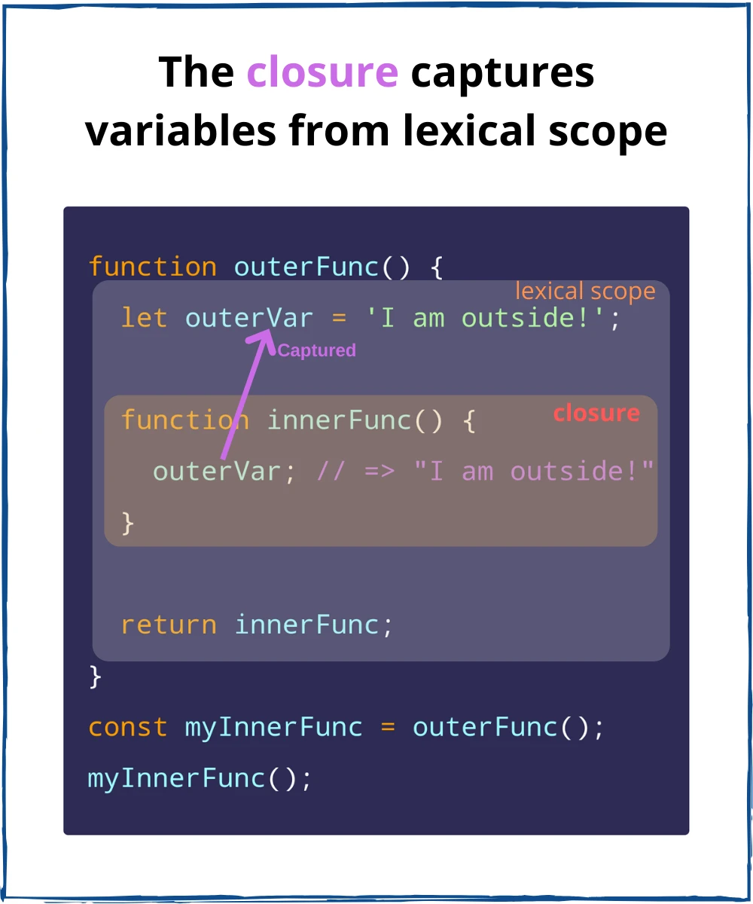

## 클로저란 무엇인가?

- 어떤 함수가 자신의 내부가 아닌 외부에서 선언된 변수에 접근하는 것을 말한다.
- 따라서 둘러싸는 함수가 종료 되더라도 외부 범위의 값에 접근 할 수 있다.

**일반적인 함수 예제가 있다.**

```jsx
function outerFunc() {
  let outerVar = "I am outside!";

  function innerFunc() {
    console.log(outerVar); // => logs "I am outside!"
  }

  innerFunc();
}

outerFunc();
```

- 함수 innerFunc() 스코프 안에서 outerVar 변수의 접근을 허용하고 있다.
- 또 함수 innerFunc()의 호출은 함수 outerFunc() 안에서 하고있다.

**이 예제를 변형해서 과연 함수 innerFunc()를 함수 outerFunc() 안이 아닌 외부에서 호출 할때 outerVar 변수에 접근할 수 있는지 확인해보자.**

```jsx
function outerFunc() {
  // lexical scope -> 렉시컬 스코프는 자신이 속한 영역을 의미
  let outerVar = "I am outside!";

  function innerFunc() {
    // closure
    console.log(outerVar); // => logs "I am outside!"
  }

  return innerFunc;
}

const myInnerFunc = outerFunc();
myInnerFunc();
```

- 이제 innerFunc()는 함수 외부에 있는 myInnerFunc 변수에 담겨져 outerFunc() 밖에서 호출된다.
- 실행 결과는 놀랍게도 함수 innerFunc()가 outerVar 변수의 값을 기억하고 있다.
- 이것을 바로 `클로저`라고 한다.
  
- 함수 innerFunc()가 함수 outerFunc()에 있는 outerVar 변수의 값을 기억하고 있기 때문이다.
- 더 간단하게 말하자면, 클로저는 나중에 실행되는 `위치에 관계없이 정의된 위치의 변수를 기억하는 함수`라고 생각하면 된다.

## 클로저를 사용하는 이유

### 함수의 캡슐화

- 웹 프론트에서 이벤트를 다룰 때 콜백 함수를 사용한다. inline에 사용하거나 onScroll, onClick, addEventListener 메소드를 사용할 때에도 콜백 함수를 지정한다.
- 클로저를 사용해 같은 비슷한 기능의 함수를 `캡슐화`할 수 있다.

```jsx
// padding을 부여하는 함수 정의
function makePaddingSizer(padding) {
  return function () {
    document.body.style.padding = padding + "px";
  };
}

var padding4 = makePaddingSizer(4);
var padding8 = makePaddingSizer(8);
var padding12 = makePaddingSizer(12);
```

- 콜백 함수를 생성하는 makePaddingSizer 함수다.
- makePaddingSizer 함수는 인자로 size를 받아 클로저 함수를 리턴한다.
- onClick 메소드에 할당

```jsx
document.getElementById("size-12").onclick = size12;
document.getElementById("size-14").onclick = size14;
document.getElementById("size-16").onclick = size16;
```

### **은닉화 (private method 구현)**

- 클로저를 사용하면 `은닉화`가 가능하고 내부 변수와 메서드를 안전하게 관리할 수 있다.
- 일반적으로 이름 규칙을 통해 (`_name` )으로 private property/method를 명시한다.
- 하지만 수정은 얼마든지 가능하다.
- 아래 예제를 살펴보자.

```jsx
function Human(name) {
  this._name = name;
}

Human.prototype.greeting = function () {
  console.log(this._name + "님 반갑습니다!");
};

var HM = new Human("우성");

HM.greeting(); // '우성 님 반갑습니다!'
HM._name = "경민";
HM.say(); // '경민 님 반갑습니다!'
```

- private 변수에 쉽게 접근할 수 있고, 변경도 얼마든지 가능하다.
- 클로저를 사용해 private 변수를 사용하는 과정을 살펴보자.

```jsx
function HumanGreeting(name) {
  var _name = name;
  return function () {
    console.log(_name, "님 반갑습니다!");
  };
}

var HM = HumanGreeting("우성");

HM(); // '우성 님 반갑습니다!'
```

- 이렇게 되면 이제 내부 변수 name을 바꿀 방법이 사라지게 된다.
- 하지만 클로저를 매번 사용하면 메모리 공가을 차지하기 때문에, 꼭 필요한 경우가 아니라면 클로저를 사용하지 않는 것이 좋다.

✔️ 참고 
<br />
[Closure | PoiemaWeb](https://poiemaweb.com/js-closure)

[[자바스크립트] 클로저(closure) 바로알기](https://www.daleseo.com/js-closures/)

[자바스크립트 클로저 설명, 예시, 활용](https://oneroomtable.tistory.com/entry/%EC%9E%90%EB%B0%94%EC%8A%A4%ED%81%AC%EB%A6%BD%ED%8A%B8-%ED%81%B4%EB%A1%9C%EC%A0%80-%EC%84%A4%EB%AA%85-%EC%98%88%EC%8B%9C-%ED%99%9C%EC%9A%A9)

[JavaScript Scope and Closures | CSS-Tricks](https://css-tricks.com/javascript-scope-closures/)

